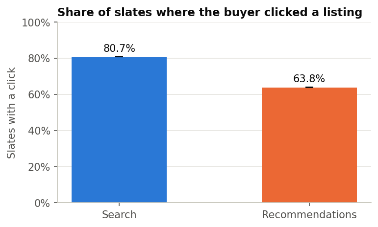
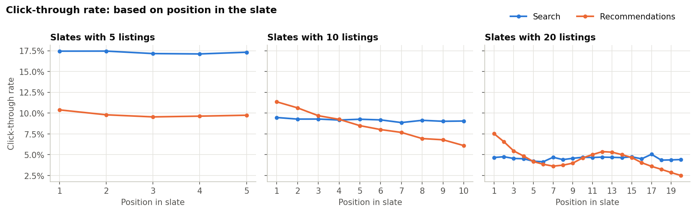
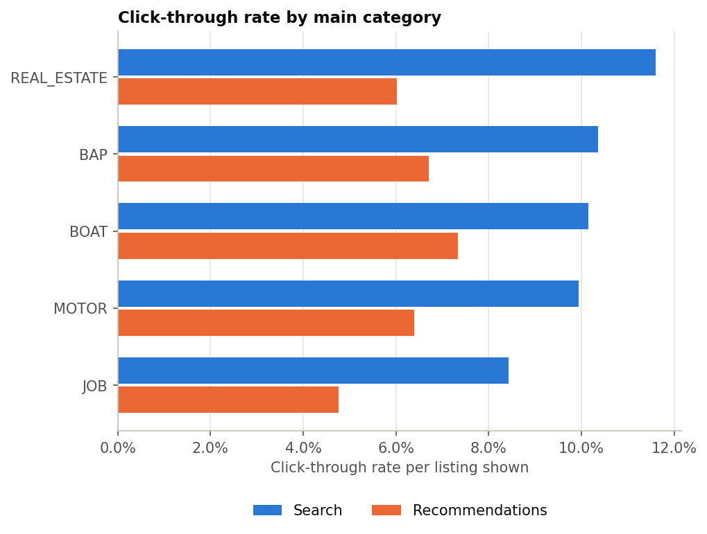

# FINN Marketplace Analytics

How buyers on FINN move from seeing a listing to clicking it, how a change to that journey can be
measured reliably, and whether a recommender model beats simple baselines on real clicks.

Two kinds of data, kept strictly apart:

- **Real data.** The FINN.no slate dataset: which listings buyers were shown in search results and
  recommendations, and which listing they clicked. Findings from this data are findings about FINN.
- **Simulated data** (Part 2). An A/B test of FINN's paid "recommended listing" boost, with clicks
  and contacts simulated from a click model calibrated on the real data. Results validate the
  analysis method. They are not findings about FINN.

## Status

| Part | Content | Status |
|---|---|---|
| 1 | Real data: loading, data quality, dbt models, findings | Done |
| 2 | Simulated A/B test of the recommended-listing boost, with validation | Done |
| 3 | Recommender (ALS + LightGBM) evaluated on real clicks | Done |
| Dashboard | Tableau Public dashboards | In progress |

## Part 1: Findings from the real data

Random 5% sample of users: 113,404 buyers and 1,862,954 slates (search pages and recommendation
blocks). Intervals are 95%, resampled by buyer. Details:
[`analysis/real_data_findings.ipynb`](analysis/real_data_findings.ipynb).

| Finding | Figures |
|---|---|
| **Buyers click far more in search than in recommendations.** A search expresses what the buyer wants; a recommendation has to guess. | Slates with a click: search 80.7% (80.6–80.8), recommendations 63.8% (63.6–64.0); gap 16.9 pts (16.7–17.1) |
| **Position barely matters in search.** | Click rate about 17% (5-listing slates), 9% (10), 4.5% (20); first vs fifth listing 1.02× (1.00–1.04) |
| **Position clearly matters in recommendations.** Position and the recommender's ranking are mixed in these numbers. | Click rate 11.4% at position 1 to 6.1% at position 10 (10-listing slates) |
| **Search beats recommendations in every category.** | Real estate 11.6% vs 6.0%; boats 10.2% vs 7.3%; jobs 8.4% vs 4.8% (lowest in both) |

| Search vs recommendations | Click rate by position | Click rate by category |
|---|---|---|
|  |  |  |

## Part 2: A/B test of the recommended-listing boost (simulated)

> **Everything in this section is simulated.** It shows how the effect of a paid product would be
> measured and that the analysis recovers known true effects. It is not a finding about FINN.

| | |
|---|---|
| **Question** | How many extra clicks does *Anbefalt annonse* (a paid boost in recommendations) give the paying seller, and how much is taken from other sellers or lost for buyers? |
| **Hypothesis** | Moving a promoted listing to position 1 raises its click-through without cutting buyers' overall chance of clicking a recommendation by more than 1% (relative). |
| **Pre-registration** | Design, metrics, parameters and decision rule in [`docs/ab_test_protocol.md`](docs/ab_test_protocol.md), committed before the simulation ran. |
| **Design** | A fixed 6.25% of listings are boosted; buyers are split 50/50 into boost-on and boost-off. Comparing buyer groups, not boosted against other listings, avoids the bias from boosted listings pushing others down. |
| **Click model** | Calibrated on real click rates by position. Assumption `λ = 0.5` sets how much of the drop by position is caused by position itself. Boost-off reproduces the real click rate (58.1% vs 58.5% of slates with a click). |
| **Potential outcomes** | Every slate is simulated with and without the boost on the same random numbers, so the true effect is known and stored apart from the analysed data. |
| **Analysis** | Ratio metrics, delta-method intervals clustered by buyer, bootstrap over buyers as a cross-check. |

**Results.** 76,625 buyers, 467,239 recommendation slates. Sample ratio check: 38,181 vs 38,444
buyers, p = 0.34 (passed).

| Metric | Boost-off | Boost-on | Relative change (95% CI) | True change |
|---|---|---|---|---|
| Boosted-listing click-through (primary) | 7.51% | 8.44% | +12.4% (+9.3% to +15.6%) | +11.9% |
| Slates with a click (guardrail) | 58.21% | 58.16% | −0.09% (−0.77% to +0.60%) | +0.01% |
| Other listings' click-through | 7.50% | 7.43% | −1.0% (−1.5% to −0.5%) | −0.76% |
| Boosted-listing contact rate | 0.26% | 0.26% | +0.1% (−15.0% to +17.8%) | +7.6% |

| | |
|---|---|
| **Decision** | **Keep the boost.** The boosted listing gains about 12% more clicks, mostly taken from other listings; buyers' overall clicking is unchanged. The interval includes the 10% value hurdle, so the test cannot say whether the gain clears it (expected at design stage). |
| **Validation** | Every interval contains its true effect. In 500 repeated assignments, 94.6–96.2% of 95% intervals contained the true effect for every metric (threshold 93%): **passed**. |
| **Lesson 1** | Contacts are too rare to measure a change this size (interval −15% to +18%), so they are a diagnostic, not the primary metric. |
| **Lesson 2** | The guardrail limit sits at the edge of what the sample can measure: the decision matched the truth in 85% of repetitions, and the misses come from the guardrail's ±0.7% interval dipping below −1% by chance. |

Full results: [`analysis/results/experiment_report.md`](analysis/results/experiment_report.md).

## Part 3: Recommender evaluated on real clicks

| | |
|---|---|
| **Question** | Can a model that sees a buyer's first 5 interactions predict which listing they click next better than simple baselines, and does the gain justify a live A/B test? |
| **Setup** | Buyers are split by hash into train (70%), validation (10%) and test (20%); buyers with 5 or fewer interactions always train. The first 5 interactions are known; later clicks are the labels. Test: 22,349 buyers. |
| **Models** | **ALS** retrieves 200 candidates per buyer (256 factors, alpha 300, chosen by NDCG@10 on validation). **LightGBM** (lambdarank) re-orders them into a top 10 using ALS score, popularity, category match, county match and search share. |
| **Rule-based baselines** | Popularity (most-clicked listings) and category popularity (most-clicked in the buyer's top category). Not models. |
| **Option A, dropped** | A LightGBM trained on listings FINN showed (clicked vs skipped) was worse than ALS on the candidate shortlist (different population) and, in FINN's own slates, no measurably better than FINN's order (+0.002 NDCG). |
| **Settings frozen** | All tuning on validation only; test scored once. |

**Results on test buyers** (hit@10 = share of buyers whose next click is in their top 10):

| Popularity | Category popularity | ALS | LightGBM option A | **ALS + LightGBM (B)** |
|---|---|---|---|---|
| 0.38% | 0.47% | 4.76% | 1.19% | **5.36%** |

**B minus ALS** (paired by buyer, 95% interval):

| hit@10 | NDCG@10 | recall@10 |
|---|---|---|
| +0.60 pts (0.41–0.78) | +0.0029 (0.0019–0.0039) | +0.21 pts (0.15–0.27) |

**Within FINN's own slates** (NDCG of re-ranking the shown listings, 9,701 buyers):

| FINN order | Random | Popularity | ALS score | Option A |
|---|---|---|---|---|
| 0.5160 | 0.4967 | 0.5286 | 0.5205 | 0.5182 |

**Beyond accuracy** (table `mart_rec_beyond_accuracy`, also in Snowflake): B covers the largest share
of listings and leans least on the top 1% most-clicked. About 1.3% of buyers get a popularity
fallback list.

**Conclusion.** ALS with LightGBM re-ordering is the best recommender on real clicks. It is about
11 times better than the baselines and beats ALS alone on every metric, with intervals above zero:
a relative gain of about 13% in hit@10. The absolute gain is small, and the evidence is offline, so
this **justifies a live A/B test, not a launch.** Test design follows Part 2: buyers randomised
50/50, click-through on recommendations as the primary metric, overall clicking as the guardrail,
and a sample size set from the precision the guardrail needs. Error analysis by buyer activity,
category and target popularity: [`analysis/recommender_results.ipynb`](analysis/recommender_results.ipynb).
Full write-up: [`docs/recommendation.md`](docs/recommendation.md).

## Data quality

The loader and dbt tests check the data against FINN's documented structure. The sample matches
FINN's published statistics: 30.3% of slates are recommendations (FINN: 30.3%), 24.4% have no click
(FINN: 24%), 11.14 slots per slate with removed items counted (FINN: 11.14).

| Check | Result | Handling |
|---|---|---|
| One item removed from slates | 220,325 slates (11.8%): 17.2% of recommendation, 9.5% of search | Flagged `has_removed_item`, left out of position analysis |
| Click on a removed item | 6,792 slates (0.4%), all with a removed item | Same flag |
| Missing listing identity (`<UNK>`, item id 2) | 15–17% of listings shown; no category, never clicked; even across positions (14.9–15.6%) | Lowers all click rates by about the same share; excluded from category comparison |

These rules are enforced as dbt tests, so the build fails if the data breaks them.

## Limitations

| Area | Limitations |
|---|---|
| **Data** | Fixed 30-day snapshot, so a one-time batch load. Order of interactions but no timestamps. Listings have only an anonymous id and item group (category, subcategory, county): no price, text, image or seller. No user attributes. Data ends at the click: no contacts or deals. FINN capped slates at 25 listings. |
| **Analysis** | Slates missing an item and `<UNK>` listings are excluded from parts of the analysis. Position effects are mixed with ranking effects. The 5% sample leaves small categories (for example TRAVEL, about 1,000 listings shown) too small to analyse. |
| **Simulation (Part 2)** | Only click rates by position are real. `λ = 0.5` is an assumption. Boosted listings are random, while real sellers choose. Only reordering is simulated. Contacts follow clicks at fixed rates. |
| **Recommender (Part 3)** | Offline proxy: clicks on what FINN showed, so exposure and position bias remain. No timestamps, so popularity may include clicks that happen after the prediction. ALS tuning grid stopped at its edge (256 factors, alpha 300). Option A was trained on shown listings but scored on candidates, which is why it was dropped. |
| **Infrastructure** | Snowflake runs on a 30-day free trial. Single developer: access control and SLAs are out of scope. Data is anonymised. |

## Project structure

```
finn-marketplace-analytics/
├── pipeline/            Loading the FINN data, simulating the experiment, and their tests
├── recommender/         ALS, LightGBM and baselines: tuning, final scoring, write to Snowflake
├── snowflake/           One-time Snowflake setup (warehouse, databases, role)
├── dbt_project/         dbt models and data tests
│   ├── models/staging/        Cleaned raw tables: stg_interactions, stg_exposures, stg_items
│   ├── models/intermediate/   int_slates, int_rec_split
│   ├── models/marts/          Experiment tables, recommender training tables, mart_rec_beyond_accuracy
│   └── tests/                 Data rules found during loading
├── analysis/            Notebooks, experiment analysis, saved charts and results (rec_* files)
├── docs/                A/B test protocol, recommendation memo, tracking plan
└── dashboard/           Tableau dashboards
```

## Setup

Terminal commands run from the main project folder unless stated otherwise. SQL runs in a
Snowsight worksheet: in Snowflake's web interface, open **Projects → Worksheets** (called
**Workspaces** in newer versions), create a new SQL worksheet, paste the SQL and run it with
**Run All** (Cmd+Shift+Enter on a Mac, Ctrl+Shift+Enter on Windows).

### 1. Create the Snowflake objects

Create a Snowflake trial account, then run `snowflake/setup.sql` in a worksheet. It creates the
warehouse `FINN_WH` (X-Small, suspends after 60 seconds idle), the databases `RAW`, `DEV` and
`PROD`, and the role `FINN_ROLE`, which has access only to this project.

### 2. Create an access token for scripts

The loader, dbt and the notebooks log in with a programmatic access token. This is required if
you signed up with Microsoft or Google, since those accounts have no Snowflake password. Run:

```sql
USE ROLE ACCOUNTADMIN;

-- Allow token logins without a network policy (any network policy that exists is still enforced).
CREATE AUTHENTICATION POLICY IF NOT EXISTS RAW.PUBLIC.FINN_PAT_POLICY
  PAT_POLICY = (NETWORK_POLICY_EVALUATION = ENFORCED_NOT_REQUIRED);

SET my_user = '"' || CURRENT_USER() || '"';
ALTER USER IDENTIFIER($my_user) SET AUTHENTICATION POLICY RAW.PUBLIC.FINN_PAT_POLICY;

ALTER USER ADD PROGRAMMATIC ACCESS TOKEN finn_project
  ROLE_RESTRICTION = 'FINN_ROLE'
  DAYS_TO_EXPIRY = 30;
```

Copy the `token_secret` value straight away; it is shown only once. Check afterwards with
`SHOW USER PROGRAMMATIC ACCESS TOKENS;` that `expires_at` is 30 days after `created_on`.

### 3. Install the Python packages

```
python3 -m venv .venv
source .venv/bin/activate        # Windows: .venv\Scripts\activate
pip install uv
uv pip install -r requirements.txt
```

Run `source .venv/bin/activate` again in every new terminal window.

### 4. Add your Snowflake login details

`.env.example` is a template. Copy it to `.env` in the same folder and fill in your values in
`.env`; leave `.env.example` unchanged. `.env` is excluded from Git.

```
cp .env.example .env
```

| Setting | Where to find it |
|---|---|
| `SNOWFLAKE_ACCOUNT` | Run `SELECT CURRENT_ORGANIZATION_NAME() \|\| '-' \|\| CURRENT_ACCOUNT_NAME();` |
| `SNOWFLAKE_USER` | The `LOGIN_NAME` value from `DESC USER` |
| `SNOWFLAKE_PASSWORD` | The token from step 2 |
| `SNOWFLAKE_ROLE` | `FINN_ROLE` |
| `SNOWFLAKE_WAREHOUSE` | `FINN_WH` |

Key-pair login is also supported: set `SNOWFLAKE_PRIVATE_KEY_PATH` instead of
`SNOWFLAKE_PASSWORD`.

### 5. Set up the dbt connection

```
cp dbt_project/profiles.yml.example dbt_project/profiles.yml
```

dbt does not read `.env` itself. Before running dbt in a new terminal window, load it:

```
set -a; source .env; set +a
```

## Running the project

**1. Load the real data**

```
python pipeline/load_finn_data.py download
python pipeline/load_finn_data.py extract
python pipeline/load_finn_data.py load
```

- `download` saves the three FINN files (about 1.3 GB) to `data/source/`. If the Google Drive
  download fails, get `data.npz`, `itemattr.npz` and `ind2val.json` from the `data/` folder of
  https://github.com/finn-no/recsys_slates_dataset.
- `extract` takes a random 5% of users (seed 42) and writes flat tables and `manifest.json`
  (sample settings, row counts, file checksums, data checks) to `data/processed/`.
- `load` recreates the tables in `RAW.FINN_SLATES`, checks the row counts, and records the load
  in `RAW.FINN_SLATES.LOAD_AUDIT`.

**2. Build the dbt models**, from the `dbt_project` folder:

```
dbt build --profiles-dir .
```

This builds all models in the `DEV` database and runs all data tests.

**3. Run the findings notebook**

```
jupyter notebook analysis/real_data_findings.ipynb
```

Choose **Run → Run All Cells**. It reads from `DEV`; set `FINN_DATABASE=PROD` to read the
production build.

**4. Simulate the experiment** (only after the protocol is committed)

```
python pipeline/simulate_boost.py expected
python pipeline/simulate_boost.py simulate
```

`expected` prints the expected effects and power numbers from the real data, without drawing any
outcomes; they go into the protocol before it is committed. `simulate` draws the outcomes and loads
them into `RAW.SIMULATION`. Then run `dbt build --profiles-dir .` again to build the experiment
models.

**5. Analyse and validate the experiment**

```
python analysis/evaluate_experiment.py all
```

This runs the analysis plan, compares it with the ground truth, runs the 500-repetition coverage
check, and writes `analysis/results/experiment_report.md` and `experiment_results.json`.

**6. Run the recommender**

Open `analysis/recommender_pipeline.ipynb` with the `.venv` kernel and run it top to bottom. It
builds the four recommender dbt models, tests, scores the baselines, ALS and LightGBM, runs the
final test scoring (settings frozen, `GROUP = "test"`), writes the top-10 lists to
`RAW.RECOMMENDER.SCORES`, and builds `mart_rec_beyond_accuracy`. The tuning steps are switched off
by default because the chosen settings are saved in `analysis/results/rec_*_best_params.json`.
Then open `analysis/recommender_results.ipynb` for the walk-through, error analysis and conclusion.

## Tests

```
python -m pytest analysis pipeline recommender
```

- The loader tests check that the extract step keeps every real row, drops padding, matches the
  source values, samples reproducibly and counts the known data rules correctly.
- The simulation tests check that the boost-off world reproduces the real click rates, that
  boosted listings move to the top, that each slate gets at most one click, and that the
  assignment splits as specified.
- The analysis tests check that the delta-method intervals reach 95% coverage on clustered data
  with a known answer, and that ignoring the clustering would not.

The data tests run with `dbt build`.

## Data source

Eide et al., *FINN.no Slates Dataset*, RecSys 2021. https://github.com/finn-no/recsys_slates_dataset
